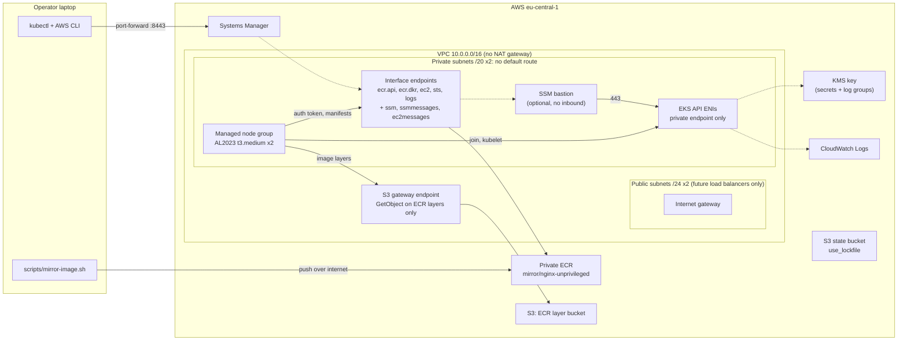
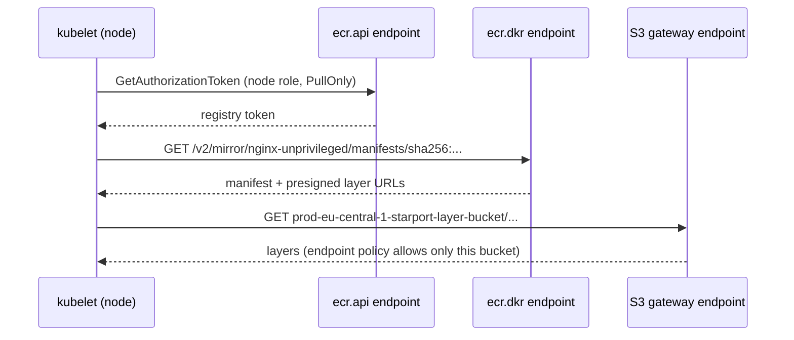

# aws-platform-terraform

[](https://github.com/hamza-sweidan/aws-platform-terraform/actions/workflows/terraform-ci.yml)

Terraform for a small AWS platform centred on a **private Amazon EKS cluster
with zero internet egress**. There's no NAT gateway, the Kubernetes API is
private only, and container images come exclusively from private ECR through
VPC endpoints. It's the air-gapped on-prem pattern, rebuilt on AWS.

- **Network:** 2-AZ VPC. Private subnets have **no default route**. S3
  gateway endpoint (policy-locked to ECR's layer bucket) plus interface
  endpoints for `ecr.api`, `ecr.dkr`, `ec2`, `sts` and `logs`.
- **EKS 1.36:** private API endpoint, access entries only (no `aws-auth`),
  KMS envelope encryption, all control-plane logs, managed add-ons, and an
  AL2023 managed node group with IMDSv2 hop limit 1.
- **Least privilege:** the VPC CNI runs under IRSA, not the node role. Nodes
  get ECR `PullOnly`. The cluster role's KMS access is scoped to one key.
- **Access:** optional SSM bastion with no SSH, no public IP and no inbound
  rules. kubectl runs on your laptop through an SSM port-forward.
- **State:** S3 backend with **native locking** (`use_lockfile`), no DynamoDB.
- **Quality gates:** `fmt`, `validate`, `tflint` (AWS ruleset) and `checkov`
  on every PR, with no cloud credentials in CI. Every accepted checkov finding
  is justified inline.

## Architecture



How a node pulls an image with no internet:



## Repository layout

```text
bootstrap/           S3 state bucket (versioned, SSE-KMS, TLS-only) + optional budget alarm
modules/
  vpc/               subnets, routing, S3 gateway + interface endpoints, flow logs
  kms/               customer managed key for EKS secrets and log groups
  iam/               cluster/node roles, IRSA for VPC CNI, EKS access entries
  eks/               private cluster, add-ons, managed node group
  bastion/           optional SSM Session Manager host
envs/dev/            composes the modules; S3 backend with native locking; ECR mirror repos
scripts/             mirror-image.sh: public image -> private ECR (crane or skopeo)
k8s/                 sample workload that runs from the mirrored ECR digest
docs/decisions/      ADRs
docs/runbook.md      failure diagnosis
```

Each module README has a hand-written design section plus generated
inputs and outputs (terraform-docs).

## Prerequisites

| Tool | Version | Notes |
|---|---|---|
| Terraform | 1.16.x | `required_version = "~> 1.16.0"` |
| AWS CLI | v2 | Credentials for an IAM user or role with admin rights in the target account |
| Session Manager plugin | latest | For the kubectl tunnel through the bastion |
| kubectl | 1.35-1.37 | Within one minor version of the cluster |
| crane or skopeo | any recent | For `scripts/mirror-image.sh` |
| bash + envsubst | | Git Bash on Windows has both |

## 1. Bootstrap remote state (once per account)

```bash
cd bootstrap
cp terraform.tfvars.example terraform.tfvars    # owner, optional budget_alert_email
terraform init
terraform plan -out=tfplan
terraform apply tfplan
terraform output -raw backend_config > ../envs/dev/backend.hcl
```

## 2. Plan and apply the dev environment

```bash
cd ../envs/dev
cp terraform.tfvars.example terraform.tfvars    # owner + your IAM ARN; enable_bastion = true
terraform init -backend-config=backend.hcl
terraform plan -out=tfplan                      # 59 resources with the bastion enabled
terraform apply tfplan                          # ~15-20 min; the EKS control plane is most of it
```

Your IAM ARN comes from `aws sts get-caller-identity --query Arn --output text`.

## 3. Verify

Terminal 1: open the tunnel (stays in the foreground):

```bash
cd envs/dev
eval "$(terraform output -raw ssm_tunnel_command)"
```

Terminal 2: point kubectl at it, then check the cluster:

```bash
cd envs/dev
eval "$(terraform output -raw kubeconfig_commands)"

kubectl get nodes -o wide                  # 2 nodes Ready, private IPs only
kubectl get pods -n kube-system            # aws-node, kube-proxy, coredns Running
aws eks list-addons --cluster-name aws-platform-dev --region eu-central-1
```

Offline demo: mirror an image, deploy it, and show there's no internet route:

```bash
cd ../..
export DEMO_IMAGE=$(scripts/mirror-image.sh docker.io/nginxinc/nginx-unprivileged:1.30-alpine)
echo "$DEMO_IMAGE"                         # <acct>.dkr.ecr.eu-central-1.amazonaws.com/mirror/nginx-unprivileged@sha256:...

kubectl apply -f k8s/namespace.yaml
envsubst '$DEMO_IMAGE' < k8s/deployment.yaml | kubectl apply -f -
kubectl apply -f k8s/service.yaml -f k8s/networkpolicy.yaml
kubectl -n offline-demo rollout status deploy/web

# 1. The pods run the private ECR image, pinned by digest
kubectl -n offline-demo get pods -o jsonpath='{range .items[*]}{.status.containerStatuses[0].imageID}{"\n"}{end}'

# 2. The service works inside the cluster
kubectl -n offline-demo exec deploy/web -- wget -qO- -T 5 http://web | grep -i '<title>'

# 3. AWS APIs resolve to private endpoint IPs (10.0.x.x)
kubectl -n offline-demo exec deploy/web -- nslookup api.ecr.eu-central-1.amazonaws.com

# 4. The internet doesn't: DNS resolves, but there is no route out
kubectl -n offline-demo exec deploy/web -- wget -qO- -T 5 https://example.com \
  || echo "no internet egress (expected)"
```

If anything fails, see the [runbook](docs/runbook.md).

## 4. Destroy

```bash
kubectl delete namespace offline-demo      # the demo creates no load balancers, but clean up anyway
cd envs/dev && terraform destroy           # ~10-15 min
```

The state bucket in `bootstrap/` has `prevent_destroy` and costs cents per
month, so leave it for the next session. To remove it completely: empty all
object versions, set `prevent_destroy = false`, then `terraform destroy` in
`bootstrap/`. The KMS key enters a 7-day pending-deletion window, as KMS
requires.

## Estimated cost (eu-central-1, on-demand)

List prices from the AWS Pricing API (September 2026). Taxes excluded.

| Component | Unit price | Quantity | USD / hour |
|---|---|---|---:|
| **EKS control plane** (standard support) | $0.10 / cluster-hour | 1 | **0.100** |
| **Interface endpoints**: ecr.api, ecr.dkr, ec2, sts, logs | $0.012 / endpoint-AZ-hour | 5 x 2 AZ | **0.120** |
| **Nodes**: t3.medium | $0.048 / hour | 2 | **0.096** |
| Node root volumes, gp3 | $0.0952 / GB-month | 2 x 20 GB | 0.005 |
| KMS customer managed key | $1 / month | 1 | 0.001 |
| CloudWatch Logs ingestion (control plane + flow logs) | $0.63 / GB | estimated 30-50 MB/h | ~0.025 |
| S3 gateway endpoint, internet gateway, ECR storage | free / negligible | | 0.000 |
| **Total, bastion off** | | | **~0.35 (~$8.40/day)** |
| Bastion: t3.micro + ssm, ssmmessages, ec2messages endpoints | $0.012 + 3 x 2 x $0.012 | | +0.087 |
| **Total, bastion on** | | | **~0.44 (~$10.50/day)** |

- Endpoint data processing is $0.01/GB, pennies for image pulls.
- `node_capacity_type = "SPOT"` cuts node cost by roughly 60-70%.
- `upgrade_policy = STANDARD` keeps the cluster from drifting into extended
  support, which adds $0.50/h.
- A 3-hour lab session costs about $1.30. **Destroy when you're done**; the
  budget in `bootstrap/` emails at 50/80/100% of the monthly limit.

## Security scan exceptions

Checkov runs over Terraform, Kubernetes, GitHub Actions and secrets. Each
accepted finding is suppressed **inline next to the resource**, with a reason:

| Check | Where | Why it's accepted |
|---|---|---|
| CKV_AWS_18 | state bucket | Access logging needs a second bucket; CloudTrail management events already record access. |
| CKV_AWS_144 | state bucket | Cross-region replication doubles cost; versioning covers the realistic failure (bad apply). |
| CKV2_AWS_62 | state bucket | Nothing consumes event notifications for state files. |
| CKV_AWS_338 | EKS + flow log groups | 30-day retention in a lab; production would use 365+. |
| CKV_AWS_339 | EKS cluster | Checkov 3.3.19's version list stops at 1.35; EKS lists 1.36 as default in standard support. |
| CKV_AWS_109/111/356 | KMS key policy | In a key policy, `Resource "*"` means this key. The root statement is AWS's default delegation to IAM. |
| CKV_K8S_14/43 | Deployment | The image is injected at deploy time as an ECR digest, which is stronger than a tag. |
| CKV_K8S_15 | Deployment | `IfNotPresent` is correct for digest-pinned images and survives brief ECR endpoint outages. |

Fixed rather than skipped: CKV_AWS_394. AZs are an explicit allowlist, so
the subnet layout can't shift when AWS adds a zone.

## CI

[`.github/workflows/terraform-ci.yml`](.github/workflows/terraform-ci.yml)
runs on every pull request to `main`:

1. `terraform fmt -check -recursive`
2. `terraform validate` in every directory containing `.tf` files,
   discovered at runtime, with `init -backend=false`, so **no credentials**
3. `tflint --recursive` with the pinned AWS ruleset
4. `checkov` with the repo config

Actions are pinned to commit SHAs, and the workflow token is `contents: read`.

## Design decisions

- [0001: No NAT gateway](docs/decisions/0001-no-nat-gateway.md)
- [0002: S3 native state locking](docs/decisions/0002-s3-native-state-locking.md)
- [0003: Private-only API endpoint](docs/decisions/0003-private-only-api-endpoint.md)
- [0004: SSM over SSH](docs/decisions/0004-ssm-over-ssh.md)

## Roadmap

- **Phase 2**: `azure/`, an azurerm hub-and-spoke network (hub VNet, two
  spokes, peering, NSGs, Azure Policy for required tags) with the same
  quality gates and docs.
