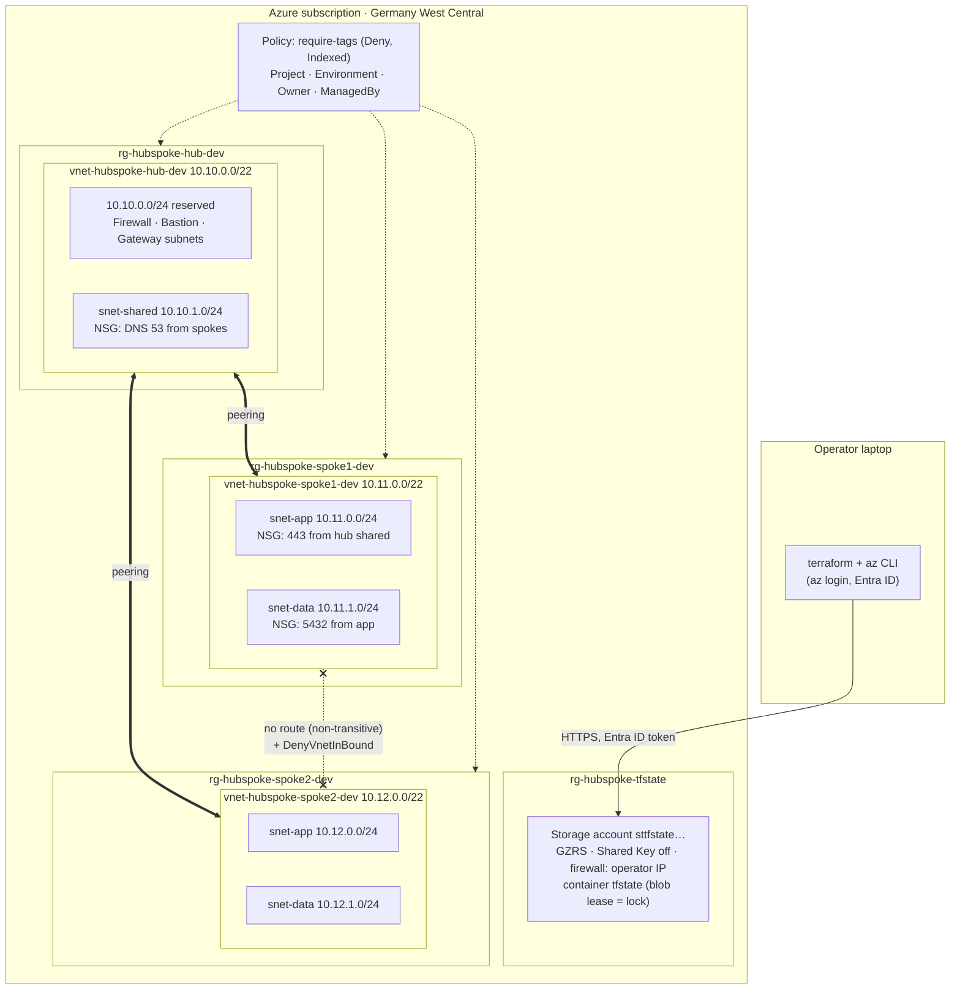

# azure/: hub-and-spoke network

Phase 2 of this repo: an Azure hub-and-spoke network built with the same
rules as the AWS platform. That means reusable modules, pinned versions,
remote state, `fmt`/`validate`/`tflint`/`checkov` in CI, ADRs and a runbook.
It also adds offline `terraform test` suites.

- **Topology:** one hub VNet and two spoke VNets, each spoke peered to the hub.
  Peering isn't transitive, so the spokes can't reach each other.
- **NSGs:** one per subnet, default-deny east-west. The baseline overrides
  Azure's `AllowVnetInBound`, which would otherwise open every peered VNet.
  Subnets are private (no default outbound access) and deny the internet.
- **Azure Policy:** a custom *required tags* definition with effect **Deny**,
  assigned to every platform resource group. It backstops the azurerm
  provider's missing `default_tags`.
- **State:** Azure Blob Storage with **Entra ID-only access** (Shared Key
  disabled), a storage firewall, versioning, and blob-lease locking.
- **Idle cost: $0.00/hour.** VNets, NSGs, peering and Policy have no hourly
  charge.

## Architecture



## Repository layout

```text
azure/
  bootstrap/          state storage account (Entra ID only) + optional budget
  modules/
    vnet/             VNet, private subnets, one default-deny NSG per subnet
    vnet-peering/     both hub<->spoke links, with address-space re-sync
    tag-policy/       required-tags policy definition + per-RG Deny assignments
  envs/dev/           hub + two spokes + peering + policy; traffic matrix
scripts/azure-state-firewall.sh   allow your current IP through the state firewall
docs/decisions/0005-0008   Azure ADRs
docs/runbook-azure.md      Azure failure diagnosis
```

Every module README has a design section plus generated inputs and outputs.
The modules and the environment also have a `tests/` directory; see
[Tests](#tests).

## Prerequisites

| Tool | Version | Notes |
|---|---|---|
| Terraform | 1.16.x | `required_version = "~> 1.16.0"` |
| Azure CLI | 2.x | `az login`; the account needs Owner (or Contributor + User Access Administrator) on the subscription for the role assignment and policy |
| azurerm provider | 5.6.x | Pinned by the committed lock files |

## 1. Bootstrap remote state (once per subscription)

```bash
az login
az account show --query id -o tsv                 # your subscription ID
curl -s https://api.ipify.org; echo               # your public IP for the storage firewall

cd azure/bootstrap
cp terraform.tfvars.example terraform.tfvars      # subscription_id, owner, allowed_ip_ranges, budget email
terraform init
terraform plan -out=tfplan                        # 5 resources, 4 without a budget email
terraform apply tfplan
terraform output -raw backend_config > ../envs/dev/backend.hcl
```

On a different network later (office, travel), let your new IP through the
state firewall before running Terraform:

```bash
scripts/azure-state-firewall.sh allow
```

## 2. Plan and apply the dev environment

```bash
cd ../envs/dev
cp terraform.tfvars.example terraform.tfvars      # subscription_id, owner
terraform init -backend-config=backend.hcl        # a 403 right after bootstrap: runbook §1
terraform plan -out=tfplan
terraform apply tfplan                            # a few minutes
```

## 3. Verify

`terraform output -raw verify_commands` prints these, filled in for your
environment:

```bash
# Both links of every peering are Connected and FullyInSync
az network vnet peering list -g rg-hubspoke-hub-dev --vnet-name vnet-hubspoke-hub-dev \
  --query "[].{name:name, state:peeringState, sync:peeringSyncLevel}" -o table

# Each spoke only knows the hub's range (10.10.0.0/22), never the other spoke's
az network vnet peering list -g rg-hubspoke-spoke1-dev --vnet-name vnet-hubspoke-spoke1-dev \
  --query "[].remoteAddressSpace.addressPrefixes" -o tsv

# NSG on a data subnet: AllowPostgresFromApp (100), AllowSameSubnetInBound (4000),
# DenyVnetInBound (4096), DenyInternetOutBound (4096)
az network nsg rule list -g rg-hubspoke-spoke1-dev --nsg-name nsg-hubspoke-spoke1-dev-data -o table

# The tag policy in action: an untagged NSG is refused...
az network nsg create -g rg-hubspoke-hub-dev -n nsg-policy-test -l germanywestcentral
#   -> (RequestDisallowedByPolicy) ... Every resource here needs these tags ...

# ...and a tagged one is allowed (delete it straight away)
az network nsg create -g rg-hubspoke-hub-dev -n nsg-policy-test -l germanywestcentral \
  --tags Environment=dev ManagedBy=Terraform Owner=<you> Project=hubspoke \
  && az network nsg delete -g rg-hubspoke-hub-dev -n nsg-policy-test
```

A new policy assignment can take a while to take effect. If the untagged
NSG is created anyway right after the first apply, delete it and retry a
bit later.

If anything fails, see the [Azure runbook](../docs/runbook-azure.md).

## 4. Destroy

```bash
cd azure/envs/dev && terraform destroy
```

The state account in `azure/bootstrap` has `prevent_destroy` and costs cents
per month, so leave it for the next session. To remove it completely, delete
`prevent_destroy` from the account and container, then run `terraform destroy`
in `azure/bootstrap`. Destroy the environments first, since their state lives
there.

## Estimated cost

List prices from the Azure Retail Prices API, Germany West Central, USD
(September 2026). Taxes excluded.

| Component | Price | This lab |
|---|---|---:|
| VNets, subnets, NSGs, resource groups | free | **$0.00/h** |
| Azure Policy definitions and assignments (Azure resources) | free | **$0.00/h** |
| VNet peering, intra-region | $0.01/GB in + $0.01/GB out | $0.00 with no VMs sending traffic |
| State storage, Hot GZRS | $0.046/GB-month + $0.1175 per 10K writes | < $0.10/month |
| Consumption budget | free | $0.00 |
| **Total while idle** | | **$0.00/h** |

What the design leaves room for, and what it would cost if added:

| Add-on | List price | Where it goes |
|---|---|---|
| Azure Firewall Basic / Standard | $0.395/h / $1.25/h + $0.065 / $0.016 per GB | Reserved `AzureFirewallSubnet` in the hub |
| VPN gateway VpnGw1 | $0.19/h | Reserved `GatewaySubnet`; `use_hub_gateway = true` |
| Virtual WAN standard hub (alternative topology) | $0.25/h + $0.02/GB | Replaces the hub VNet; see ADR 0005 |

## Tests

The azure/ modules also have offline unit tests. Each `tests/*.tftest.hcl`
uses `mock_provider "azurerm"`, so `terraform test` plans with no credentials
and no backend. CI runs them on every pull request.

| Suite | Checks |
|---|---|
| `modules/vnet` | Baseline rules on every NSG, inbound/outbound field mapping, private subnets, tags, rejection of reserved/duplicate priorities and mixed service-tag lists |
| `modules/vnet-peering` | Both links, safe defaults, gateway transit on both sides, re-sync triggers |
| `modules/tag-policy` | `Indexed` mode, rule loops over the parameter, one assignment per RG, bad effects rejected |
| `envs/dev` | Full plan: 2 spokes + 2 peerings, address plan, tags on every RG, policy tags == Terraform tags, overlap validation |

```bash
cd azure/modules/vnet && terraform init -backend=false && terraform test
```

## Security scan exceptions

Checkov findings accepted in `azure/`, each suppressed inline next to the
resource with its reason:

| Check | Where | Why it's accepted |
|---|---|---|
| CKV2_AZURE_1 | state account | Customer-managed keys need a Key Vault and a key whose loss makes state unreadable. Microsoft-managed keys + infrastructure encryption instead. |
| CKV_AZURE_59, CKV2_AZURE_33 | state account | No private path from the laptop into Azure. Public endpoint limited by firewall (default Deny, operator IP only) and Entra-only auth. |
| CKV_AZURE_33 | state account | Queue logging; the account has no queues. |
| CKV2_AZURE_21 | state container | Blob read logging needs a Log Analytics workspace (billed per GB). Versioning keeps every state revision. |

Fixed rather than skipped: CKV_AZURE_206 (replication raised from ZRS to GZRS).

## Design decisions

- [0005: Hub-and-spoke with native VNet peering](../docs/decisions/0005-hub-and-spoke-with-vnet-peering.md)
- [0006: Default-deny NSG baseline and private subnets](../docs/decisions/0006-default-deny-nsg-baseline.md)
- [0007: Required tags with an Azure Policy Deny at resource-group scope](../docs/decisions/0007-tag-policy-deny-at-resource-group-scope.md)
- [0008: Azure state with Entra ID-only access](../docs/decisions/0008-azure-state-entra-id-only.md)
